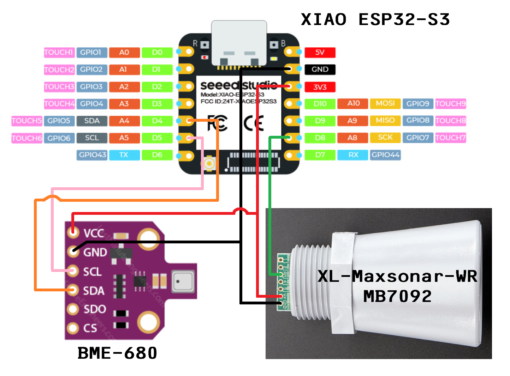
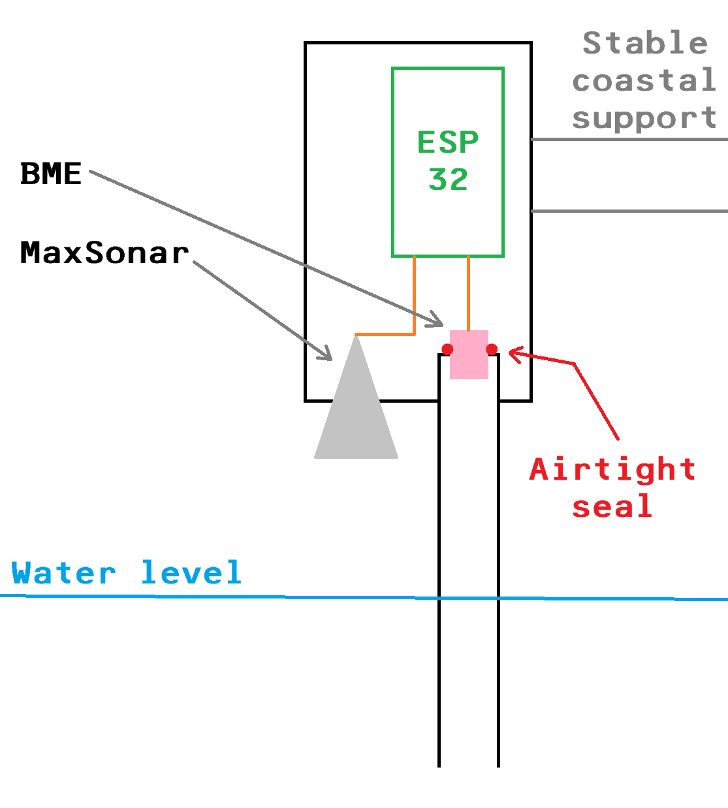

# Coastal Water Level and Pressure Sensor

This project is an ESP32-based water level and pressure sensor designed for coastal monitoring. It uses two specific sensors to measure environmental data.

## Components

- **ESP32**: The main microcontroller used for processing and communication.
- **Adafruit BME680**: A sensor that measures temperature, humidity, pressure, and gas.
- **MaxSonar**: An analog ultrasonic sensor for measuring distance.

## Features

- Measures temperature, humidity, pressure, and gas levels using the BME680 sensor.
- Measures water depth using the MaxSonar sensor.
- Outputs data via serial communication for monitoring and logging.

## Wiring

- **BME680**:
  - Connect VCC to 3.3V
  - Connect GND to GND
  - Connect SCL to GPIO22 (or the appropriate I2C SCL pin)
  - Connect SDA to GPIO21 (or the appropriate I2C SDA pin)
- **MaxSonar**:
  - Connect VCC to 3.3V
  - Connect GND to GND
  - Connect AN to GPIO36 (or the appropriate analog pin)

## Code

The code for this project is located in [ESP-32-sensor-code-depth-pressure.ino](Sensors/water-depth-coast/ESP-32-sensor-code-depth-pressure/ESP-32-sensor-code-depth-pressure.ino).

## Usage

1. Upload the code to the ESP32 using the Arduino IDE.
2. Open the Serial Monitor at a baud rate of 115200.
3. Observe the sensor readings for temperature, humidity, pressure, gas, and water depth.

## Assembly suggestions

To protect your sensor from the elements, we suggest you use PVC piping as an enclosure for your circuit.
The sonar sensor should be sticking out of the enclosure, towards the water surface.
The assembly of the pressure sensor is a bit more complex. It should be isolated in an airtight tube to let pressure build up as the water rise

## Dependencies

- [Adafruit BME680 Library](https://github.com/adafruit/Adafruit_BME680)
- [Adafruit Sensor Library](https://github.com/adafruit/Adafruit_Sensor)

## License

This project is licensed under the MIT License.

## Authors

- Louis Gaillard

## Acknowledgments

- This project is part of the CARAIBE WAVE 2025 initiative.
